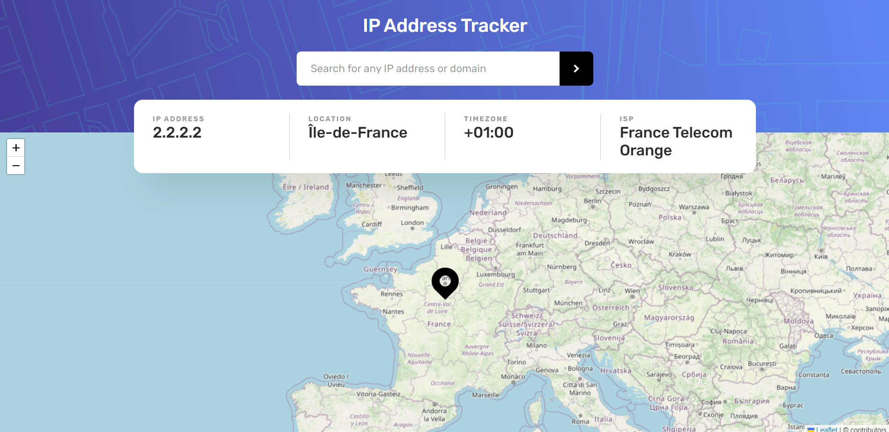

# IP TRACKER

IP-Tracker is a responsive web application built with React and Tailwind CSS, inspired by a Figma design layout provided by FrontendMentor.

## Features:

- Responsive design for various screen sizes.
- Interactive web application using React.
- Stylish and maintainable UI with Tailwind CSS.

### FrontendMentor Challenge:

[https://www.frontendmentor.io/challenges/ip-address-tracker-I8-0yYAH0](https://www.frontendmentor.io/challenges/ip-address-tracker-I8-0yYAH0)

### Demo:

[https://ip-tracker-qnmbry0c7-ronaldodev03.vercel.app/](https://ip-tracker-qnmbry0c7-ronaldodev03.vercel.app/)

### FrontendMentor Profile:

[https://www.frontendmentor.io/profile/Ronaldodev03](https://www.frontendmentor.io/profile/Ronaldodev03)
